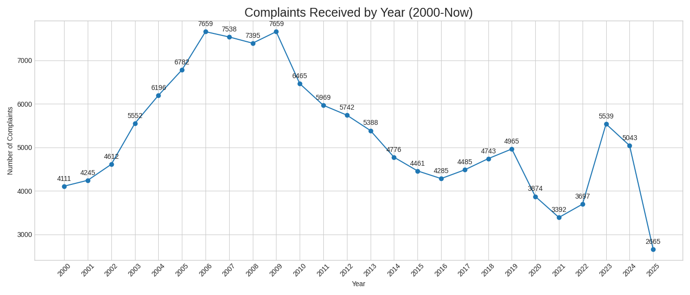
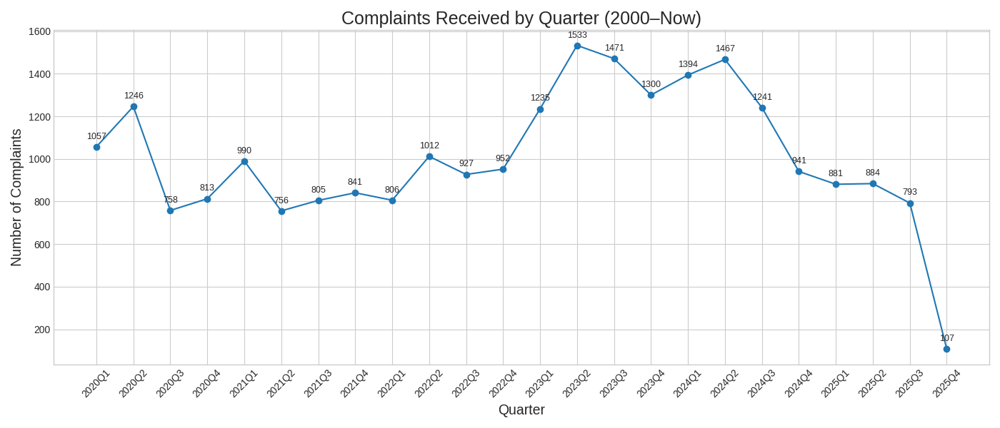
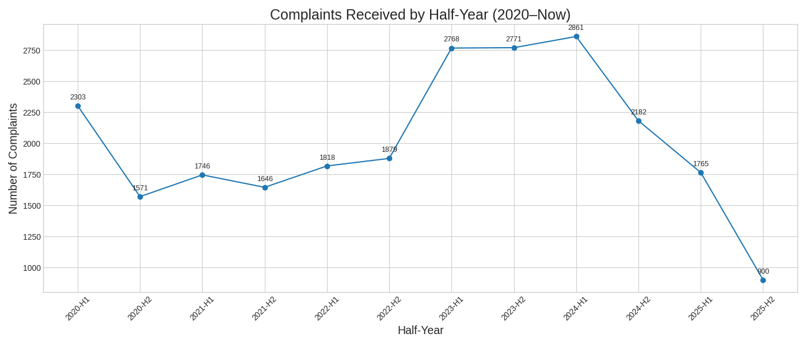

# OAG Data Scientist – Code Sample

## 1. Overview

This repository contains a code sample submitted as part of my application for the Data Scientist position at the Office of the New York State Attorney General (OAG).

The goal of this project is to demonstrate:
- data handling and cleaning in Python  
- organization of analytical workflows  
- ability to work with government-style public datasets  
- reproducible and well-documented analysis  

The analysis focuses on police misconduct data released by the NYC Civilian Complaint Review Board (CCRB), using complaint, allegation, officer, and penalty datasets.


---

## 2. Datasets Used
This analysis uses four official datasets released by [CCRB](https://data.cityofnewyork.us/browse?Dataset-Information_Agency=Civilian+Complaint+Review+Board+(CCRB)):

- **[Police Officers](https://data.cityofnewyork.us/Public-Safety/Civilian-Complaint-Review-Board-Police-Officers/2fir-qns4/about_data)**
- **[Allegations Against Police Officers](https://data.cityofnewyork.us/Public-Safety/Civilian-Complaint-Review-Board-Allegations-Agains/6xgr-kwjq/about_data)**
- **[Complaints Against Police Officers](https://data.cityofnewyork.us/Public-Safety/Civilian-Complaint-Review-Board-Complaints-Against/2mby-ccnw/about_data)**
- **[Penalties](https://data.cityofnewyork.us/Public-Safety/Civilian-Complaint-Review-Board-Penalties/keep-pkmh/about_data)**

These datasets together describe:
- Complaint events
- Individual allegations
- Officer-level background and complaint history
- Disciplinary outcomes

## 3. Data Dictionary

Below is a detailed description of all columns included in the four datasets.

---

### A. Police Officers — Column Definitions

| Column | Meaning |
|--------|---------|
| **As Of Date** | Latest data snapshot date |
| **Tax ID** | Anonymized officer identifier (primary key for joining) |
| **Active Per Last Reported Status** | Whether the officer was active as of the last report |
| **Last Reported Active Date** | Most recent date when the officer was reported active |
| **Officer First Name / Last Name** | Officer’s name (often partially anonymized) |
| **Officer Race** | Officer’s race |
| **Officer Gender** | Officer’s gender |
| **Current Rank Abbreviation** | Officer’s current rank abbreviation |
| **Current Rank** | Officer’s current rank title |
| **Current Command** | Officer’s current assigned unit |
| **Shield No** | Officer’s shield/badge number (may be redacted) |
| **Total Complaints** | Total number of complaints filed against the officer |
| **Total Substantiated Complaints** | Number of substantiated complaints |

---

### B. Allegations Against Police Officers — Column Definitions

| Column | Meaning |
|--------|---------|
| **As Of Date** | Data snapshot update date |
| **Complaint Id** | Identifier linking to the complaint case |
| **Complaint Officer Number** | Officer index within the same complaint (not a real ID) |
| **Tax ID** | Anonymized officer identifier (used to join across datasets) |
| **Officer Rank Abbreviation At Incident** | Rank abbreviation at the time of the incident |
| **Officer Rank At Incident** | Full rank title at the time of the incident |
| **Officer Command At Incident** | Officer’s assigned command/unit at the incident |
| **Officer Days On Force At Incident** | Number of days the officer had served at the time of the incident |
| **Allegation Record Identity** | Unique identifier for the allegation record |
| **FADO Type** | Category of allegation: Force, Abuse of Authority, Discourtesy, Offensive Language |
| **Allegation** | Specific allegation description (e.g., chokehold, improper stop) |
| **Victim/Alleged Victim Age Range At Incident** | Victim’s age range |
| **Victim/Alleged Victim Gender** | Victim’s gender |
| **Victim / Alleged Victim Race (Legacy)** | Legacy race classification |
| **Victim / Alleged Victim Race / Ethnicity** | Updated race/ethnicity classification |
| **CCRB Investigations Division Recommendation** | Investigations Division recommendation for the allegation |
| **CCRB Allegation Disposition** | CCRB’s final disposition for the allegation |
| **NYPD Allegation Disposition** | NYPD’s final disposition for the allegation |

---

### C. Complaints Against Police Officers — Column Definitions

| Column | Meaning |
|--------|---------|
| **As Of Date** | Timestamp indicating when the data snapshot was last updated |
| **Complaint Id** | Unique identifier for the complaint case |
| **Incident Date** | Date when the incident occurred |
| **Incident Hour** | Hour of the incident |
| **CCRB Received Date** | Date when the complaint was received by CCRB (used for monthly/quarterly trend charts) |
| **Close Date** | Date when the complaint case was closed |
| **Borough Of Incident Occurrence** | NYC borough where the incident occurred |
| **Precinct Of Incident Occurrence** | NYPD precinct of the incident |
| **Location Type Of Incident** | Type of location (street, residence, transit, etc.) |
| **Reason for Police Contact** | Reason police and civilians came into contact (traffic stop, investigation, etc.) |
| **Outcome Of Police Encounter** | Final outcome of the encounter (arrest, no arrest, force used, etc.) |
| **CCRB Complaint Disposition** | CCRB’s overall disposition of the complaint |
| **BWC Evidence** | Whether body-worn camera video exists |
| **Video Evidence** | Whether any video evidence exists |

---

### D. Penalties — Column Definitions

| Column | Meaning |
|--------|---------|
| **As Of Date** | Date of data snapshot |
| **Complaint Id** | Complaint case associated with the penalty |
| **Tax ID** | Officer receiving the penalty |
| **CCRB Substantiated Officer Disposition** | CCRB’s disposition for a substantiated allegation |
| **Board Discipline Recommendation** | CCRB’s recommended disciplinary action |
| **Non-APU NYPD Penalty Report Date** | NYPD penalty report date for non-APU cases |
| **Officer is_APU** | Whether the case was handled by the Administrative Prosecution Unit (APU) |
| **APU CCRB Trial Recommended Penalty** | CCRB’s penalty recommendation for APU trials |
| **APU Trial Commissioner Recommended Penalty** | Penalty recommended by the trial commissioner |
| **APU Plea Agreed Penalty** | Penalty agreed upon in a plea agreement |
| **APU Case Status** | Status of the APU case (pending, closed, etc.) |
| **APU Closing Date** | Date when the APU case was closed |
| **NYPD Officer Penalty** | NYPD’s final disciplinary action |

---

### Relationship Between Datasets

```
Police Officers   <---- Tax ID ---- Allegations ---->  Complaints (Complaint ID)
                               \
                                \---- Penalties (per officer per complaint)
```

Together, the four datasets form a complete framework for analyzing police misconduct, investigations, and accountability outcomes.

## 4. Analysis Workflow
1. Load and inspect raw datasets  
2. Convert date fields and clean missing values  
3. Create monthly and quarterly time-series views  
4. Visualize complaint trends  
5. (Optional) Merge with allegation/officer/penalty datasets for deeper analysis 


## 5. Visualizations
Key plots include:
- **Complaints Received by Year**

- **Complaints Received by Quarter**

- **Complaints Received by Half Year**


These visualizations help identify long-term structural trends and short-term fluctuations in CCRB complaint volume.

## 6. Key Findings (To be filled)


## 7. Reproducibility
To run the notebooks:

```bash
pip install -r requirements.txt
```

## 8. 

```
oag-ds-sample/
├── README.md
├── data/
├── notebooks/
│   ├── 01_eda.ipynb
├── reports/
│   ├── figures/
└── requirements.txt
```

## 9. Notes

All datasets are public and sourced from NYC Open Data.